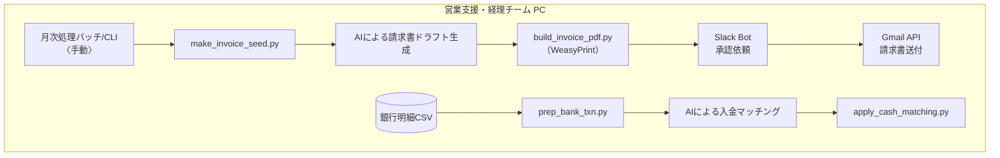

# WBS202506b - 月次請求・入金処理自動化 PoC

## プロジェクト概要

このプロジェクトは、月次請求書生成と入金マッチング処理を自動化する**Proof of Concept (PoC)** です。OpenAI API（GPT-4o, OpenRouter経由）を使用して、AIによる請求書ドラフト生成と入金マッチングを行います。

### 🎯 PoCの目的
- 請求書自動化システムの技術的実現可能性の検証
- 月次業務の効率化効果の測定
- 運用プロセスの最適化

### 📋 開発・テスト環境
- **ローカル開発環境**: Windows/Linux/macOS
- **テスト実行**: `python -m pytest tests/ -v`
- **CI/CD**: 不要（PoCのため、ローカルテストのみ）
- **外部サービス連携**: Gmail API、Slack API（ローカル環境でのみ動作）

## 概要

このプロジェクトは、月次請求書生成と入金マッチング処理を自動化するProof of Concept (PoC) です。OpenAI API（GPT-4o, OpenRouter経由）を使用して、AIによる請求書ドラフト生成と入金マッチングを行います。

## 業務プロセス

### 全体フロー



### 月次処理ステップ詳細

| #  | 担当        | 処理・操作                                   | 入出力                                 | 所要⏱   |
| -- | --------- | --------------------------------------- | ----------------------------------- | ----- |
| 1  | 営業支援      | バッチ処理実行（Web UI または CLI）              | –                                   | 1 分   |
| 2  | (自動)      | **請求シード生成** `make_invoice_seed.py`      | TXT／CSV → `invoice_seed_YYYYMM.csv` | 1 分   |
| 3  | (AI)      | **AIによる請求書ドラフト生成**                    | `draft_invoice_YYYYMM.json`         | 1 分   |
| 4  | (自動)      | **PDF生成** `build_invoice_pdf.py` 実行   | PDF一式                               | 1 分   |
| 5  | Slack Bot | 承認依頼を PM へ送信（Approve/Reject ボタン）        | `approval_status.csv`               | –     |
| 6  | PM        | ボタンで承認／却下                               | –                                   | 〜30 分 |
| 7  | (自動)      | 承認完了後 **Gmail送付** 実行         | Gmail 送信 & `mail_log.csv`           | 5 分   |
| 8  | 経理        | 銀行 CSV を共有フォルダへ配置                       | –                                   | –     |
| 9  | (自動)      | **銀行データ前処理** `prep_bank_txn.py` 実行      | `bank_YYYYMM.csv`                   | 1 分   |
| 10 | (AI)      | **AIによる入金マッチング**                    | `match_suggestion.csv`              | 1 分   |
| 11 | (自動)      | **仕訳生成** `apply_cash_matching.py` 実行 | `journal_YYYYMM.csv`                | 2 分   |

*≪合計実働：約 45 分／月≫*

### 役割分担と所要時間

| 役割   | 月次作業           | 時間        |
| ---- | -------------- | --------- |
| 営業支援 | バッチ実行・PDF生成・送信 | **15 分**  |
| PM   | 内容確認・承認        | **〜30 分** |
| 経理   | 銀行CSV取込・消込確定   | **15 分**  |

### エラー・例外ハンドリング

| レイヤ       | 検知                     | 自動アクション               | 運用対応         |
| --------- | ---------------------- | --------------------- | ------------ |
| スクリプト     | `try/except` → エラーログ出力 | CLI に赤字表示             | 再実行 or ソース修正 |
| AI 出力欠損   | schema validation       | 処理停止                  | AI で再実行    |
| Slack 未承認 | 24h 経過                 | Bot がリマインド            | PM が当日対応     |
| 入金不一致     | match_score < 0.7     | `manual_review.csv` へ | 経理が調査        |

### KPI（目標値）

| 指標       | 目標         | 現状 (As‑Is)     |
| -------- | ---------- | -------------- |
| 月次工数     | **≤ 1 h**  | 8 h            |
| 承認遅延率    | **0 %**    | 15 %           |
| 入金突合自動化率 | **≥ 70 %** | 0 %            |
| PDF 生成失敗 | **0 件**    | Excel COM 障害多発 |

## 主な機能

### 🤖 AI機能
- **請求書ドラフト生成**: プロジェクト情報から業務内容・備考をAIで自動生成
- **入金マッチング**: 請求書データと入金データの照合をAIで自動実行

### 📊 データ処理
- 請求書シードデータ生成
- 銀行取引データ前処理
- データ検証・バリデーション

### 📄 PDF生成
- WeasyPrintを使用した請求書PDF生成
- HTMLテンプレートベースのカスタマイズ可能なレイアウト

### 📧 通知・送信
- Slack通知（進捗・エラー・承認依頼）
- Gmail APIを使用した請求書メール送信

## 技術スタック

- **Python 3.12+**
- **OpenAI API** (GPT-4o via OpenRouter)
- **WeasyPrint** (PDF生成)
- **Gmail API** (メール送信)
- **Slack API** (通知)
- **SQLite** (承認ワークフロー)

## ディレクトリ構成

```
WBS202506b/
  ├─ config/
  ├─ cursor/
  ├─ data/
  │    ├─ email_recipients.example.json
  │    └─ ...
  ├─ docs/
  ├─ get_gmail_token.py
  ├─ logs/
  ├─ output/
  ├─ pyproject.toml
  ├─ requirements.txt
  ├─ src/
  │    ├─ ai/
  │    ├─ data_processing/
  │    ├─ email/
  │    ├─ main_execution.py
  │    ├─ notifications/
  │    ├─ pdf_generation/
  ├─ static/
  ├─ templates/
  ├─ tests/
  ├─ utils/
  │    └─ logger.py
  ├─ web_entry.py
  └─ ...
```

## セットアップ

### 1. 依存関係のインストール

```bash
pip install -r requirements.txt
```

### 2. 環境変数の設定

1. プロジェクトルートにある`.env.example`をコピーして`.env`を作成します。

```sh
cp .env.example .env
```

2. `.env`ファイルをエディタで開き、各種APIキーやトークン、必要な設定値を入力してください。

```env
# OpenRouter (OpenAI API)
OPENROUTER_API_KEY=your_openrouter_api_key_here
OPENROUTER_BASE_URL=https://openrouter.ai/api/v1
OPENROUTER_MODEL=openai/gpt-4o

# Slack
SLACK_BOT_TOKEN=your_slack_bot_token
SLACK_WEBHOOK_URL=your_slack_webhook_url
SLACK_DEFAULT_CHANNEL=#general

# Gmail API
GMAIL_CLIENT_ID=your_gmail_client_id
GMAIL_CLIENT_SECRET=your_gmail_client_secret
GMAIL_REFRESH_TOKEN=your_gmail_refresh_token
GMAIL_SENDER=your_email@gmail.com
```

### 3. データファイルの準備

`data/`ディレクトリに以下のファイルを配置してください：
- `Project_master.csv` - プロジェクトマスターデータ
- `03_Bank_Data_Final.csv` - 銀行取引データ
- `Client_Master.csv` - クライアントマスターデータ

### 4. メール送信先設定

`data/email_recipients.json`を`data/email_recipients.example.json`からコピーし、必要に応じて編集してください。

## 使用方法

### Web UI（推奨）

```bash
python web_entry.py
```

ブラウザで http://localhost:5000 にアクセスし、バッチ実行や進捗確認が可能です。

### コマンドライン実行

#### 請求書生成処理
```bash
python src/main_execution.py --mode invoice
```

#### 入金マッチング処理
```bash
python src/main_execution.py --mode matching
```

#### テスト実行
```bash
pytest
```

#### その他のサブコマンド例
- 銀行データバリデーション:  
  `python -m src.data_processing.bank_data_validator`
- マッチング仕訳作成:  
  `python -m src.data_processing.apply_cash_matching`

## ロギング・デバッグ

- ログは `logs/app.log` にJSON Lines形式で出力されます。
- 詳細なデバッグログを有効化したい場合は、`utils/logger.py` のコメントを参考に `console_handler` を有効化してください。
  ```python
  # utils/logger.py
  console_handler = logging.StreamHandler()
  console_handler.setFormatter(JsonLinesFormatter())
  logger.addHandler(console_handler)
  ```
- デバッグログ（logger.debug）はデフォルトではファイルにのみ出力されます。

## 補足
- 各種バッチ・サブコマンドの詳細は `src/` 配下の各モジュールのdocstringやコメントを参照してください。
- テストデータやサンプルデータは `data/` 配下に格納されています。
- 機密情報（APIキー等）は `.env` や `data/email_recipients.json` で管理し、git管理対象外です。

## 請求書作成処理

### 処理概要
プロジェクトマスターデータから請求書シードを生成し、AIによる請求書ドラフト生成からPDF作成、承認ワークフロー、メール送信までを自動化する処理です。

### 処理フロー
1. **請求書シード生成** - プロジェクトマスターデータから請求書シードデータを生成
2. **AIによる請求書ドラフト生成** - AIによる業務内容・備考の自動生成
3. **PDF生成** - WeasyPrintを使用した請求書PDFの生成
4. **Slack承認ワークフロー** - PMへの承認依頼と承認・却下処理
5. **Gmail送信** - 承認完了後の請求書メール送信

### 新機能: 請求書シード生成
請求契約テキストファイルとプロジェクトマスターデータから、AI処理用の請求書シードデータを自動生成する機能です。

#### 主な機能
- **請求契約解析**: テキストファイルからプロジェクト情報を正規表現で抽出
- **プロジェクト情報補完**: プロジェクトマスタから追加情報を取得・補完
- **データ検証**: 生成されたシードデータの妥当性検証
- **差分比較ログ**: 各処理段階でのデータ変化を詳細ログ出力

#### 入力データ形式
**請求契約テキストファイル例:**
```
PRJ_0001、A社
2024年6月度： 100000 円
PRJ_0002、B社
2024年6月度： 200000 円
```

**プロジェクトマスタCSV例:**
```csv
プロジェクトID,Client ID,プロジェクト名称,プロジェクトマネージャID
PRJ_0001,Client_004,プロジェクトA,ishida.kento
PRJ_0002,Client_001,プロジェクトB,takahashi.misaki
```

#### データマッピング
| 入力項目 | 出力項目 | 説明 |
|---------|---------|------|
| `PRJ_XXXX` | `project_id` | プロジェクトID（4桁ゼロパディング） |
| 会社名 | `client_name` | クライアント名 |
| `YYYY年MM月度` | `billing_year`, `billing_month` | 請求年月 |
| 金額 | `billing_amount` | 請求金額 |
| プロジェクトマスタから取得 | `client_id`, `project_name`, `pm_id` | 追加情報の補完 |

#### 品質保証
- **単体テスト**: 8個のテストケースで品質保証
- **データ整合性チェック**: 6項目の妥当性検証
- **エラーハンドリング**: ファイル読み込み・解析失敗時の適切な処理
- **差分比較ログ**: 各処理段階でのデータ変化を詳細記録

#### 出力ファイル
- `output/seed/invoice_seed_YYYYMM.csv` - 請求書シードデータ
- 列構成: `project_id`, `client_id`, `client_name`, `project_name`, `pm_id`, `billing_year`, `billing_month`, `billing_amount`

### 新機能: AIによる請求書ドラフト生成
プロジェクト情報から業務内容や備考をAIで自動生成し、請求書の品質と一貫性を向上させる機能です。

#### 主な機能
- **業務内容生成**: プロジェクト名・期間から適切な業務内容を自動生成
- **備考欄生成**: プロジェクト特性に応じた備考欄の自動生成
- **データ検証**: 生成された請求書データの妥当性検証
- **エラーハンドリング**: 生成失敗時の自動リトライ機能

#### データマッピング
| 入力項目 | 出力項目 | 説明 |
|---------|---------|------|
| `project_name` | `work_description` | プロジェクト名から業務内容を生成 |
| `project_period` | `work_period` | プロジェクト期間の自動設定 |
| `client_name` | `client_name` | クライアント名の設定 |
| `amount` | `amount` | 請求金額の設定 |
| プロジェクト特性 | `remarks` | 備考欄の自動生成 |

#### 品質保証
- **単体テスト**: 15個のテストケースで品質保証
- **データ整合性チェック**: 8項目の妥当性検証
- **エラーハンドリング**: 自動リトライ機能付き

### 承認ワークフロー
Slack Botを使用した承認ワークフローにより、PMが請求書内容を確認・承認してからメール送信が実行されます。

#### ワークフロー機能
- **承認依頼**: 請求書PDFと共にPMへ承認依頼を送信
- **承認・却下**: ボタンクリックによる簡単な承認・却下処理
- **リマインド**: 24時間経過後の自動リマインド機能
- **ログ管理**: 承認履歴のSQLiteデータベース管理

### 実行方法
```bash
python src/main_execution.py --mode invoice
```

### 出力ファイル
- `output/invoice_seed/invoice_seed_202401.csv` - 請求書シードデータ
- `output/ai_output/draft_invoice_202401.json` - AI生成請求書ドラフト
- `output/pdf/invoice_*.pdf` - 生成された請求書PDF
- `output/approval/approval_status.csv` - 承認状況ログ
- `output/mail/mail_log.csv` - メール送信ログ

## 入金マッチング処理

### 処理概要
入金データと請求書データをAIでマッチングし、仕訳データを生成する処理です。

### 処理フロー
1. **銀行データ前処理** - 銀行取引データの前処理・検証
2. **AIによる入金マッチング** - AIによる請求書と入金のマッチング
3. **JSON→CSV変換処理** - AIマッチング結果をCSV形式に変換 ⭐ **新規追加**
4. **入金マッチング適用** - マッチング提案の適用・仕訳生成

### 新機能: JSON→CSV変換処理
AIが生成したマッチング提案JSONファイルを、入金マッチング処理で使用するCSV形式に変換する機能を追加しました。

#### 主な機能
- **データ変換**: JSONからCSVへの自動変換
- **client_name取得**: 請求書データから実際の会社名を取得
- **データ整合性チェック**: プロジェクトID、金額、信頼度スコアの妥当性検証
- **エラーハンドリング**: データ不整合時の自動修正機能

#### データマッピング
| JSON項目 | CSV項目 | 説明 |
|---------|---------|------|
| `invoice_id` | `project_id` | プロジェクトID |
| `payment_id` | `transaction_id` | 取引ID |
| `match_amount` | `amount`, `matched_amount` | マッチング金額 |
| `confidence_score` | `match_score` | 信頼度スコア |
| 請求書データから取得 | `client_name` | 実際の会社名 |

#### 品質保証
- **単体テスト**: 10個のテストケースで品質保証
- **データ整合性チェック**: 5項目の妥当性検証
- **エラーハンドリング**: 自動修正機能付き

### 実行方法
```bash
python src/main_execution.py --mode matching
```

### 出力ファイル
- `output/ai_output/match_suggestion_202401.json` - AIマッチング結果
- `output/ai_output/match_suggestion_202401.csv` - 変換済みCSVファイル ⭐ **新規**
- `output/journal/journal_*.csv` - 生成された仕訳データ

---

（このREADMEは2025年6月時点の最新構成・運用に基づいています） 